  

  &nbsp;
  &nbsp;
  &nbsp;
  

  <b>Second-year CS student building systems that survive real users.</b> 
  I care less about which framework and more about how the pieces hold together when the load, the edge cases, and the deadlines arrive.

---

## ◢ Live in production

<table width="100%">
<tr>
<td width="50%" align="center">

</td>
<td width="50%" align="center">

</td>
</tr>
</table>

**[NUMRA](https://numra.co.il)** is a Hebrew-first platform where a teacher launches a live race and a classroom of students solves arithmetic from their own devices. I built it on a **server-authoritative game engine** — scoring, difficulty, power-ups, route decisions, catch-up logic, and final rankings all live on the backend, so the game stays fair no matter what a client sends.
 `React 19` · `Spring Boot 4` · `PostgreSQL` · `SSE` · `AWS EC2/RDS` · `Docker` · `Caddy`

**[PawPals](https://dogsocial.vercel.app)** is a full-stack social network — user and dog profiles, posts, follows, reactions, image uploads, and playdate scheduling. It's where I got hands-on with authentication, relational modeling, ownership rules, pagination, race conditions, and real production error handling. **[Source →](https://github.com/alonbaron/dogsocial)**
 `React` · `Spring Boot` · `MySQL` · `JWT` · `Railway` · `Vercel`

> **[Gal Baron Insurance](https://www.galb-ins.co.il)** — a production Hebrew/RTL site for an independent agent: accessible service discovery, a lead funnel, EmailJS contact flows, WhatsApp integration, SEO metadata, and AWS Amplify hosting. Source stays private — it's client work.

---

## ◢ How I build

  

- **Model first.** Start with data, flows, and invariants — not framework choices.
- **Enforce at the core.** Keep business rules where they can be guarded and tested.
- **Design the failure paths** as deliberately as the happy ones.
- **Use AI to move fast,** keep the engineering judgment human.
- **Ship small, reversible changes** over impressive rewrites.

---

## ◢ Open source — Claude Code skills

  

**[alon-skills](https://github.com/alonbaron/claude-skills)** packages how I work into six installable [Claude Code](https://code.claude.com) skills: an **architect** that writes the design before the code, a parallel **review-swarm**, an **ask-the-council** decision panel, a strict **prompt-generator**, a repo **up-to-date** preflight, and **ponytail** for ruthless simplicity. One install, MIT-licensed. **[Install &amp; source →](https://github.com/alonbaron/claude-skills)**
 `Claude Code` · `agentic development` · `MIT`

---

## ◢ Other systems &amp; experiments

| Project | What it explores |
|---|---|
| **ALMAS / Virtual Try-On** | A high-end jewelry configurator + image-based virtual try-on workflow — `Next.js` · `TypeScript` · `Python` · `FastAPI`. |
| **[Dining Philosophers](https://github.com/alonbaron/DiningPhilosophers)** | Concurrency visualizer using global lock ordering and `ReentrantLock` to kill deadlock and races. |
| **[Mortal Madmach](https://github.com/alonbaron/MortalMadmachGame)** | A Java Swing arena game — AI behavior, combat state, custom art, audio, rounds, power-ups. |
| **[Telegram Survey Bot](https://github.com/alonbaron/TelegramApiSurveyBot)** | Java desktop app that builds Telegram surveys, collects inline-button votes, and charts results in Swing. |
| **[Connect Four](https://github.com/alonbaron/connect4)** | Configurable React game — local/AI modes, timers, undo, animated state transitions. |
| **[ID Validator &amp; Wordle](https://github.com/alonbaron/IDChecker_WordleGame)** | Checksum validation + a two-pass repeated-letter algorithm for correct Wordle feedback. |

---

## ◢ Toolkit

<table>
<tr><td><b>Languages</b></td><td><code>Java</code> <code>Python</code> <code>TypeScript</code> <code>JavaScript</code> <code>SQL</code></td></tr>
<tr><td><b>Application</b></td><td><code>Spring Boot</code> <code>React</code> <code>REST</code> <code>JWT</code> <code>JPA / Hibernate</code></td></tr>
<tr><td><b>Data &amp; delivery</b></td><td><code>PostgreSQL</code> <code>MySQL</code> <code>Docker</code> <code>AWS</code> <code>Railway</code> <code>Vercel</code></td></tr>
<tr><td><b>Workflow</b></td><td><code>Git</code> <code>testing</code> <code>architecture docs</code> <code>agentic development</code></td></tr>
</table>

---

  Currently studying CS · building live products · working in a healthcare Information Systems team. 
  <b>Build the model. Define the rules. Then write the code.</b>

