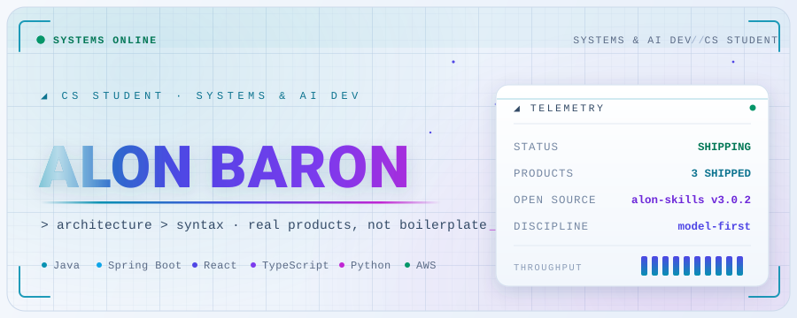
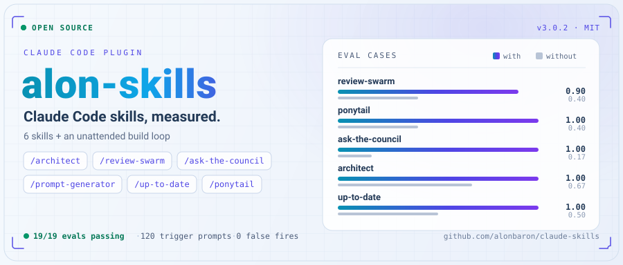
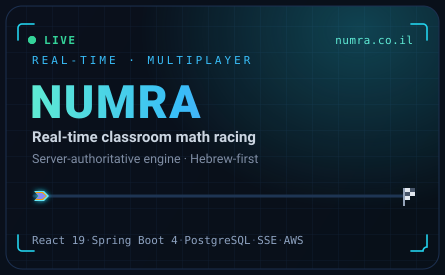
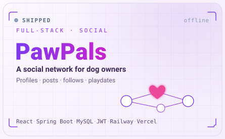
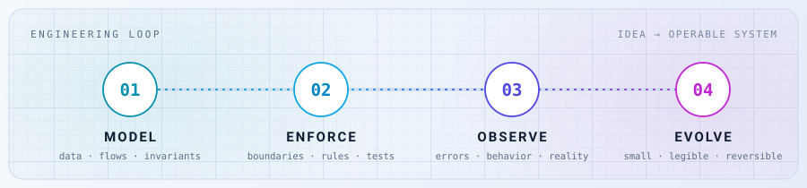

<p align="center">
  
</p>

<p align="center">
  <a href="https://github.com/alonbaron/claude-skills"></a>&nbsp;
  <a href="https://github.com/alonbaron/claude-skills#-evals"></a>&nbsp;
  <a href="https://github.com/alonbaron/dogsocial"></a>&nbsp;
  <a href="https://github.com/alonbaron"></a>&nbsp;
  <a href="mailto:alonbaron123@gmail.com"></a>
</p>

<p align="center">
  &nbsp;
  &nbsp;
  &nbsp;
  
</p>

<p align="center">
  <b>CS student · Systems &amp; AI Dev.</b><br>
  <sub>I build software that gets used by people who aren't me — a classroom platform, a social network, a tender tracker a paying customer runs on — and open-source developer tooling that I measure instead of just trusting. I care less about which framework and more about how the pieces hold together when the load, the edge cases, and the deadlines arrive.</sub>
</p>

---

## ◢ alon-skills — Claude Code skills, measured

<p align="center">
  <a href="https://github.com/alonbaron/claude-skills"></a>
</p>

**[alon-skills](https://github.com/alonbaron/claude-skills)** is a Claude Code plugin that packages how I build software into six skills and one workflow, and measures them instead of asking you to trust them.

- **Six skills.** **architect** writes the design docs before the code. **review-swarm** runs six parallel specialist reviewers, then verifiers that try to refute each finding, and returns a ranked `file:line` report. **ask-the-council** seats advisors who are made to disagree, then commits to one recommendation with the tradeoff named. **prompt-generator** turns a vague ask into a rigorous agent prompt, and **up-to-date** runs a read-only repo preflight before work starts. **ponytail** keeps solutions minimal; it's vendored from [DietrichGebert/ponytail](https://github.com/DietrichGebert/ponytail) (MIT). Each skill fires on the shape of the task and has a written boundary for when to stay quiet.
- **Build loop.** `/alon-skills:build-loop` works through a `TODO_WORKFLOW.md` one row at a time without supervision: plan → spec → build → independent review lenses → fix → close. Every stage is a fresh subagent on the model tier that fits the job, and state lives in the repo, not the chat. Measured once on a throwaway repo, it built, reviewed and closed one row in about four minutes for $1.75.
- **Evals.** A `claude plugin eval` suite runs every case with and without the plugin. All 19 cases pass. Across 120 trigger prompts, each skill fired on 80–100% of the prompts meant for it and never on the others.

| Eval case | With the plugin | Without |
|---|:---:|:---:|
| **review-swarm** on a real diff with an N+1 query | **0.90** | 0.40 |
| **ponytail** asked for a pluggable cache with one caller | **1.00** | 0.40 |
| **ask-the-council** reaching a verdict and handing off the build | **1.00** | 0.17 |
| **architect** speccing a feature from scratch | **1.00** | 0.67 |
| **up-to-date** on a branch that was never pushed | **1.00** | 0.50 |

<sub>These are the cases with the clearest uplift. Some cases score the same without the plugin because they test when a skill should stay quiet; the [full table](https://github.com/alonbaron/claude-skills#-evals) has all 19.</sub>

```text
/plugin marketplace add alonbaron/claude-skills
/plugin install alon-skills@alonbaron
```
`Claude Code` · `agentic workflows` · `evals` · `MIT` · **[Source & releases →](https://github.com/alonbaron/claude-skills)**

---

## ◢ Shipped

<table width="100%">
<tr>
<td width="50%" align="center">

</td>
<td width="50%" align="center">

</td>
</tr>
</table>

<sub>NUMRA and PawPals both ran in production. They're offline now — nobody's on them at the moment, and I'd rather not pay for idle servers.</sub>

**NUMRA** is a Hebrew-first platform where a teacher launches a live race and a classroom of students solves arithmetic from their own devices. I built it on a **server-authoritative game engine** — scoring, difficulty, power-ups, route decisions, catch-up logic, and final rankings all live on the backend, so the game stays fair no matter what a client sends.
<br>`React 19` · `Spring Boot 4` · `PostgreSQL` · `SSE` · `AWS EC2/RDS` · `Docker` · `Caddy`

**PawPals** is a full-stack social network — user and dog profiles, posts, follows, reactions, image uploads, and playdate scheduling. It handles authentication, relational modeling, ownership rules, pagination, the race conditions of concurrent writes, and real production error handling. **[Source →](https://github.com/alonbaron/dogsocial)**
<br>`React` · `Spring Boot` · `MySQL` · `JWT` · `Railway` · `Vercel`

**TenderTrack** is the one still running. It watches 31 Israeli public bodies for new tenders and warns about deadlines. A grounded Gemini model scans them nightly. Ask a model to *find* tenders and it will occasionally invent a convincing one, so every new candidate faces a second independent grounded check before it's allowed into the database. Each body gets its own request rather than being batched, since batching splits the model's attention and costs recall. The Gemini key never leaves the Worker, and a scan that partly failed says so in red instead of quietly reporting success. *(Client product — source private.)*
<br>`Cloudflare Workers` · `D1` · `Gemini` · `Hebrew / RTL`

---

## ◢ Work

**Rav-Bariach (08) Industries** — *Student Employee · Information Systems &amp; AI* · current
I lead AI adoption across the company: hands-on enablement sessions with employees, and finding the processes worth automating. Alongside that, I build internal IT automation tooling together with the IT team.
<br>`AI adoption` · `automation` · `information systems` · `IT`

**Barzilai Medical Center** — *Student Team Lead · IT, systems &amp; software* · previously
I led the student team across a live hospital's technology stack — technical support, systems, and software. Built a **shift-scheduling automation** that turned a manual rostering chore into a repeatable system for the team — a small piece of software that quietly gave people their time back.
<br>`automation` · `scheduling` · `systems` · `IT` · `healthcare`

**Freelance — Web Development**
I build and ship production sites for real clients end to end: design, build, deploy, hand over. Most recent — **[Gal Baron Insurance](https://www.galb-ins.co.il)**, a Hebrew/RTL site for an independent agent with accessible service discovery, a lead funnel, EmailJS contact flows, WhatsApp integration, SEO metadata, and AWS Amplify hosting *(source private — client work)*.
<br>`Vite` · `EmailJS` · `WhatsApp` · `AWS Amplify` · `SEO / RTL`

---

## ◢ How I build

<p align="center">
  
</p>

- **Model first.** Start with data, flows, and invariants — not framework choices.
- **Enforce at the core.** Keep business rules where they can be guarded and tested.
- **Design the failure paths** as deliberately as the happy ones.
- **Use AI to move fast,** keep the engineering judgment human.
- **Ship small, reversible changes** over impressive rewrites.

---

## ◢ More open source

**[UnDrive](https://github.com/alonbaron/UnDrive)** removes OneDrive from a Windows PC in the order Microsoft doesn't: **secure every file first** — download cloud-only placeholders, move everything to local disk, re-point Desktop/Documents/Pictures — and only then uninstall, behind an explicit YES gate. One ~330-line stock-PowerShell script; no installer, no dependencies, safe to re-run.
<br>`PowerShell` · `Windows` · `MIT`

**[discord-music-bot](https://github.com/alonbaron/discord-music-bot)** is a self-hosted Discord music bot — YouTube streaming, slash commands, per-server queues, cut-in playback, auto-disconnect — plus a complete walkthrough for running it **24/7 free on Oracle Cloud**. Errors surface in Discord instead of failing silently.
<br>`Python` · `discord.py` · `Oracle Cloud` · `MIT`

---

## ◢ Other systems &amp; experiments

| Project | What it explores |
|---|---|
| **Shift Manager** *(private)* | Multi-tenant SaaS shift manager, built docs-before-code: the full design system (source of truth → roadmap → phased tasks) landed before implementation. Finished; source kept private — `Next.js` · `TypeScript` · `PostgreSQL + RLS` · `AWS`. |
| **[Dining Philosophers](https://github.com/alonbaron/DiningPhilosophers)** | Concurrency visualizer using global lock ordering and `ReentrantLock` to kill deadlock and races. |
| **[Mortal Madmach](https://github.com/alonbaron/MortalMadmachGame)** | A Java Swing arena game — AI behavior, combat state, custom art, audio, rounds, power-ups. |
| **[Telegram Survey Bot](https://github.com/alonbaron/TelegramApiSurveyBot)** | Java desktop app that builds Telegram surveys, collects inline-button votes, and charts results in Swing. |
| **[Connect Four](https://github.com/alonbaron/connect4)** | Configurable React game — local/AI modes, timers, undo, animated state transitions. |
| **[ID Validator &amp; Wordle](https://github.com/alonbaron/IDChecker_WordleGame)** | Checksum validation + a two-pass repeated-letter algorithm for correct Wordle feedback. |

---

<p align="center">
  <sub>CS student · Systems &amp; AI Dev · shipping real software for real users.</sub><br>
  <b>Build the model. Define the rules. Then write the code.</b>
</p>
